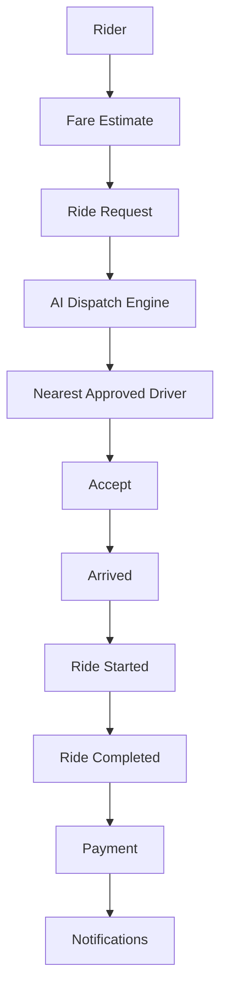
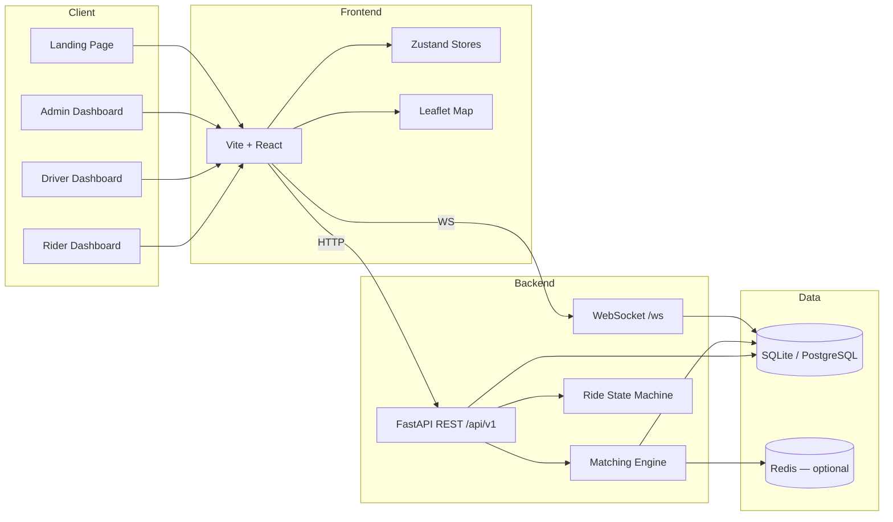

<div align="center">

# 🚖 HUMSAFAR

### AI Powered Ride Platform

**Book rides, dispatch drivers, and operate fleets — in real time.**

[](https://fastapi.tiangolo.com/)
[](https://react.dev/)
[]()
[]()
[]()
[]()
[]()
[]()
[]()

[](RELEASE_NOTES.md)
[](report.md)
[](LICENSE)

[Quick Start](#-quick-start) · [Features](#-features) · [Architecture](#-architecture) · [API](#-api-modules) · [Deploy](docs/COMMERCIAL_DEPLOYMENT.md) · [Contributing](#-contributing)

</div>

---

## 📖 Project Overview

**Humsafar** is an open-source ride-hailing platform built for riders, drivers, and operators. It combines a modern React client, a FastAPI backend, and WebSocket-powered live updates to deliver a complete trip lifecycle — from fare estimate to payment confirmation.

The dispatch engine uses **geo search + intelligent scoring** (distance, vehicle type, and ride mode) to match each request with the nearest approved driver. This is rule-based smart dispatch — not a black-box ML model.

### What ships today

| Surface | Description |
|---------|-------------|
| **Rider App** | Register, request standard or delivery rides, view fare estimates, track drivers on a live map, pay after trip completion |
| **Driver App** | Onboarding, go online/offline, receive ride offers via WebSocket, update trip status, stream GPS location |
| **Admin Panel** | Platform stats, user/driver lists, pending driver approval, ride oversight |
| **Real-time Tracking** | Rider and driver WebSockets; live map markers and route polylines |
| **AI-based Dispatch** | Matching engine scores nearby approved drivers by distance and vehicle fit |
| **Fleet Management** | Create fleets and assign drivers (admin API) |
| **Delivery Support** | Dedicated delivery ride type with package notes and vehicle filtering |
| **Notifications** | In-app notifications on ride and payment events |
| **Payment Module** | Cash payment flow (create → complete); external gateway integration planned |

> **Release status:** `v1.0.0-rc1` — staging & demo ready. See [RELEASE_NOTES.md](RELEASE_NOTES.md) and [docs/COMMERCIAL_DEPLOYMENT.md](docs/COMMERCIAL_DEPLOYMENT.md) before production.

---

## 🔄 Live Ride Flow

```
  Rider
    │
    ▼
  Fare Estimate ─────────── geocoding + pricing engine
    │
    ▼
  Ride Request ──────────── POST /api/v1/rides
    │
    ▼
  AI Dispatch Engine ────── geo search + driver scoring
    │
    ▼
  Nearest Approved Driver ─ WebSocket offer to driver
    │
    ▼
  Accept ────────────────── status: assigned → accepted
    │
    ▼
  Arrived ───────────────── driver at pickup
    │
    ▼
  Ride Started ──────────── en route to destination
    │
    ▼
  Ride Completed ────────── fare locked
    │
    ▼
  Payment ───────────────── cash flow (pending → completed)
    │
    ▼
  Notifications ─────────── rider + driver alerted
```

<details>
<summary><strong>Mermaid diagram (click to expand)</strong></summary>



</details>

**State machine:** `searching → assigned → accepted → arrived → started → completed` (or `cancelled` at eligible steps).

---

## ✨ Features

| Feature | Status | Notes |
|---------|:------:|-------|
| Authentication | ✅ | Phone + password, JWT tokens |
| JWT Security | ✅ | Protected REST & WebSocket routes |
| WebSocket | ✅ | Rider + driver real-time channels |
| Real-time Tracking | ✅ | Live GPS + map polylines |
| Admin Dashboard | ✅ | Stats, users, rides, approvals |
| Driver Approval | ✅ | Admin approves pending drivers |
| Fleet Management | ✅ | Create fleets, assign drivers |
| Delivery Mode | ✅ | Package rides with vehicle filter |
| Notifications | ✅ | DB-backed in-app notifications |
| Payments | ✅ | Cash simulation; gateway on roadmap |
| Geocoding | ✅ | Nominatim address lookup |
| Redis Geo Cache | ✅ | Optional; enable with `REDIS_ENABLED` |
| Rate Limiting | ✅ | Per-IP on login & ride endpoints |
| CI Pipeline | ✅ | GitHub Actions — build + 54 E2E tests |
| Docker Support | ✅ | `docker-compose.yml` stack |
| Alembic Migrations | ✅ | PostgreSQL-ready schema migrations |

---

## 🛠 Technology Stack

### Frontend

| | |
|---|---|
| **Framework** | React 19 + Vite |
| **State** | Zustand |
| **HTTP** | Axios |
| **Maps** | Leaflet + react-leaflet |
| **Routing** | React Router 7 |
| **Styling** | Tailwind CSS |

### Backend

| | |
|---|---|
| **API** | FastAPI |
| **ORM** | SQLAlchemy |
| **Auth** | JWT (python-jose) + bcrypt |
| **Realtime** | WebSockets |
| **Validation** | Pydantic v2 |

### Infrastructure

| | |
|---|---|
| **Dev DB** | SQLite |
| **Production DB** | PostgreSQL (Alembic migrations) |
| **Cache / Geo** | Redis (optional) |
| **Containers** | Docker + Docker Compose |
| **CI/CD** | GitHub Actions |

---

## 🏗 Architecture



**Design highlights**

- Modular backend under `backend/app/modules/` — auth, drivers, rides, admin, fleet, payments, notifications
- Centralized WebSocket connection manager for rider broadcasts and driver offers
- Vite dev proxy forwards `/api` and `/ws` to the backend on port `8000`

---

## 📁 Project Structure

```
Humsafar/
├── .github/workflows/ci.yml     # Backend E2E + frontend build/lint
├── backend/
│   ├── alembic/                 # PostgreSQL migrations
│   ├── app/
│   │   ├── modules/             # auth, drivers, rides, admin, fleet, payments, notifications
│   │   ├── matching/            # dispatch engine, geo search, scoring
│   │   ├── websocket/           # rider + driver sockets
│   │   ├── middleware/          # rate limiting
│   │   └── main.py
│   ├── Dockerfile
│   └── .env.example
├── frontend/
│   ├── src/
│   │   ├── pages/               # Home, Rider, Driver, Admin dashboards
│   │   ├── components/          # MapView, RidePanel, Navbar, …
│   │   ├── services/            # auth, ride, socket API layer
│   │   └── store/               # Zustand state
│   └── Dockerfile
├── docker/
│   └── nginx.conf               # SPA + API + WS reverse proxy
├── dev_testing/
│   └── e2e_test.py              # 54 automated integration tests
├── docs/
│   ├── COMMERCIAL_DEPLOYMENT.md # VPS, Docker, SSL, demos
│   └── CTO_RELEASE_AUDIT.md     # Technical audit
├── docker-compose.yml
├── requirements.txt
├── CHANGELOG.md
├── RELEASE_NOTES.md
└── LICENSE
```

---

## 🚀 Quick Start

### Prerequisites

- **Python 3.11+**
- **Node.js 20+**
- **npm**

### 1. Clone & configure

```bash
git clone https://github.com/your-org/humsafar.git
cd humsafar

cp backend/.env.example backend/.env
# Edit JWT_SECRET before any shared deployment
```

### 2. Backend

Dependencies live at the repo root (`requirements.txt`). Run the API from `backend/`:

```bash
pip install -r requirements.txt

cd backend
uvicorn app.main:app --reload
```

API available at **http://127.0.0.1:8000** · OpenAPI docs at **http://127.0.0.1:8000/docs**

Create an admin user (optional):

```bash
cd backend
python -m app.scripts.create_admin
```

### 3. Frontend

```bash
cd frontend
npm install
npm run dev
```

App available at **http://127.0.0.1:5000**

### 4. Docker (optional)

```bash
cp backend/.env.example backend/.env
docker compose up --build
```

See [docs/COMMERCIAL_DEPLOYMENT.md](docs/COMMERCIAL_DEPLOYMENT.md) for production topology.

---

## 🔐 Environment Variables

Copy `backend/.env.example` to `backend/.env`.

| Variable | Required | Default | Description |
|----------|:--------:|---------|-------------|
| `DATABASE_URL` | ✅ | `sqlite:///./humsafar.db` | SQLite (dev) or PostgreSQL (prod) |
| `JWT_SECRET` | ✅ | — | **Change in production** — signs JWT tokens |
| `ALGORITHM` | | `HS256` | JWT algorithm |
| `ACCESS_TOKEN_EXPIRE_MINUTES` | | `1440` | Token lifetime |
| `REDIS_URL` | | `redis://localhost:6379/0` | Redis connection string |
| `REDIS_ENABLED` | | `false` | Enable Redis geo cache |
| `CORS_ORIGINS` | ✅ | `http://localhost:5000,...` | Comma-separated allowed origins |
| `DRIVER_SEARCH_RADIUS_KM` | | `15.0` | Dispatch search radius |
| `GEOCODING_ENABLED` | | `true` | Toggle Nominatim geocoding |
| `RATE_LIMIT_LOGIN_MAX` | | `10` | Login attempts per window |
| `RATE_LIMIT_LOGIN_WINDOW` | | `60` | Login window (seconds) |
| `RATE_LIMIT_RIDE_MAX` | | `20` | Ride requests per window |
| `RATE_LIMIT_RIDE_WINDOW` | | `60` | Ride window (seconds) |

---

## 📡 API Modules

Base path: **`/api/v1`**

| Module | Prefix | Highlights |
|--------|--------|------------|
| **Auth** | `/auth` | Register (rider/driver), login, `/me` |
| **Drivers** | `/drivers` | Profile, go online/offline, location |
| **Vehicles** | `/vehicles` | Driver vehicle registration |
| **Rides** | `/rides` | Estimate, request, status transitions, history |
| **Admin** | `/admin` | Stats, users, rides, driver approval |
| **Fleet** | `/fleet` | Create fleet, list, assign drivers |
| **Payments** | `/payments` | Create & complete cash payments |
| **Notifications** | `/notifications` | List & mark read |

**Health:** `GET /health` · **Root:** `GET /`

Interactive docs: **http://127.0.0.1:8000/docs**

---

## 🔌 WebSocket Support

All WebSocket connections require a JWT passed as a query parameter: `?token=<access_token>`.

| Endpoint | Role | Purpose |
|----------|------|---------|
| `/ws/rides/{rider_id}` | Rider | Ride status updates, driver assignment events |
| `/ws/drivers/{driver_id}` | Driver | Incoming ride offers, ping/pong keepalive |

**Driver socket events**

- `location_update` — stream GPS during active rides
- Server pushes ride offers and status changes to connected clients

The Vite dev server proxies `/ws` to the backend. In Docker, Nginx terminates WebSocket upgrades — see `docker/nginx.conf`.

---

## 🛡 Security

| Control | Implementation |
|---------|----------------|
| **JWT Authentication** | Bearer tokens on REST; query token on WebSocket |
| **Role-Based Access** | `rider`, `driver`, `admin` roles with route guards |
| **Driver Approval** | Drivers must be admin-approved before dispatch |
| **Protected APIs** | `get_current_user` / `require_role` dependencies |
| **Rate Limiting** | Per-IP limits on login and ride creation |
| **CORS** | Configurable origin allowlist via `CORS_ORIGINS` |

> **Production reminder:** Set a strong `JWT_SECRET`, restrict CORS, enable HTTPS, and use PostgreSQL + Redis. See the [commercial deployment guide](docs/COMMERCIAL_DEPLOYMENT.md).

---

## 🧪 Testing

The automated E2E suite validates auth, rides, dispatch, WebSockets, admin, fleet, payments, and notifications against a running API.

**Latest validated run:** **54 / 54 tests passed (100%)**

```bash
# Terminal 1 — start backend
cd backend && uvicorn app.main:app --reload

# Terminal 2 — run suite from repo root
python dev_testing/e2e_test.py
```

Results are written to [`report.md`](report.md). CI runs the same suite on every push to `main` / `develop`.

---

## 🗺 Roadmap

| Item | Status |
|------|--------|
| Real payment gateway (Stripe / JazzCash) | 🔜 Planned |
| Driver & rider ratings | 🔜 Planned |
| SOS / emergency button | 🔜 Planned |
| Push notifications (FCM / APNs) | 🔜 Planned |
| PostgreSQL production hardening | 🔜 In progress (Alembic ready) |
| Playwright browser E2E | 🔜 Planned |
| Multi-tenant SaaS | 🔜 Planned |

Track changes in [CHANGELOG.md](CHANGELOG.md).

---

## 📸 Screenshots

> Add captures to `docs/screenshots/` and replace placeholders below.

| Landing Page | Rider Dashboard |
|:------------:|:---------------:|
|  |  |

| Driver Dashboard | Admin Dashboard |
|:----------------:|:---------------:|
|  |  |

---

## 🤝 Contributing

We welcome contributions that improve stability, documentation, and test coverage — without expanding scope silently.

### How to contribute

1. **Fork** the repository and create a feature branch from `main`
2. **Set up** local backend + frontend (see [Quick Start](#-quick-start))
3. **Run tests** — `python dev_testing/e2e_test.py` must pass
4. **Follow conventions** — match existing module layout, naming, and Pydantic schemas
5. **Open a PR** with a clear description, linked issue (if any), and test evidence

### Guidelines

- Do not commit secrets, `.env` files, or local database files
- Keep changes focused — one concern per pull request
- Update docs when changing API contracts or env vars
- No new business logic without discussion in an issue first

---

## 📄 License

This project is licensed under the **MIT License** — see [LICENSE](LICENSE).

Copyright (c) 2026 Mangla Prasad Pandey

---

<div align="center">

**Built with ❤️ using FastAPI + React**

[⭐ Star this repo](https://github.com/your-org/humsafar) · [🐛 Report a bug](https://github.com/your-org/humsafar/issues) · [📦 Release Notes](RELEASE_NOTES.md)

</div>
